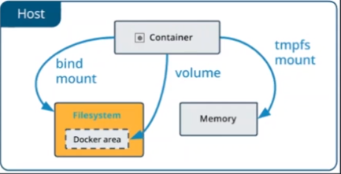
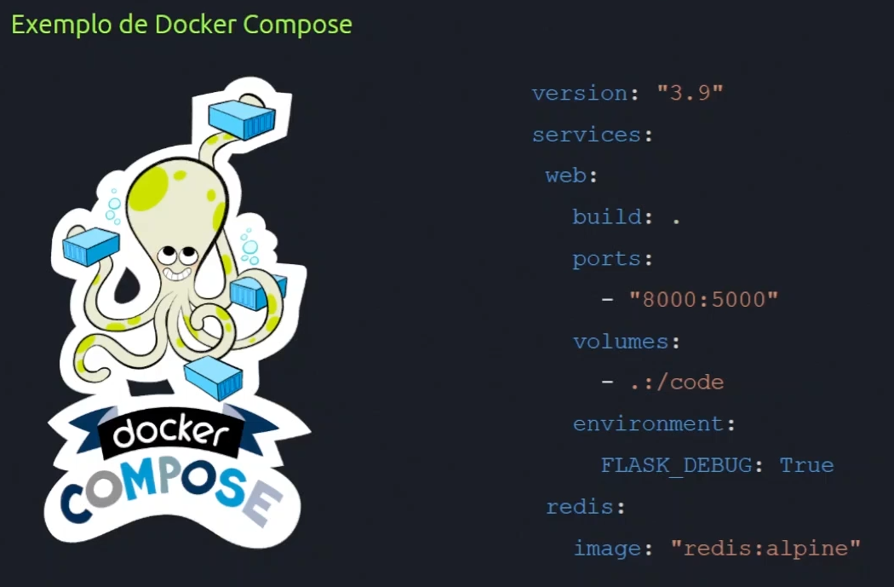

# Docker e Container

Usamos containers para **isolar** e **otimizar** aplicações e serviços, isolando-os em pequenos contextos que comunicam-se entre si. Podemos usar o **Docker** (uma ferramenta para materializar os containers em nossos sitemas) para testar nossas aplicações e rodar workloads em produção, melhorando o formato de gerar novos recursos, dar manutenção, escalar, etc.

# Instalação

É possível realizar a instalação do Docker de acordo com o seu sistema operacional a partir deste link: _https://www.docker.com/products/docker-desktop/_

# Possíveis Erros

Em meu processo de instalação do Docker, me deparei com 2 erros: 

#1 

* Ensuring Docker CLI uses the Docker Desktop context

An unexpected error occurred while ensuring the right Docker CLI context is used. Retry or check the Docker CLI context configuration using the docker context command.

#2

* Docker Desktop - Unexpected WSL error

An unexpected error occurred while executing a WSL command.

Either shut down WSL down with wsl --shutdown, and/or reboot your machine. You can also try reinstalling WSL and/or Docker Desktop. If the issue persists, collect diagnostics and submit an issue⁠.

Esses erros inviabilizavam o uso da aplicação. Para contorná-los, reiniciei o meu PC e apertei continuamente F2, conforme o modelo da minha placa-mãe, para entrar na BIOS para verificar a Virtualização.

Após adentrar na BIOS, apertei **F7** e dentro das especificações da CPU, busquei por algo parecido com "Intel Virtualization Technology (Intel VT), conforme o modelo do meu processador.

Depois de encontrar, verifiquei que essa opção estava marcada como desabilitada e o que fiz foi somente habilitá-la. Pronto! Para manter as alterações salvas e sair da BIOS, apertei F10.

# Comandos Docker

Os comandos são fundamentais para que possamos usufruir da ferramenta, permitindo que passemos instruções que serão executadas para que tudo funcione.

```sh
docker --help: Mostra todos os comandos que podemos utilizar no Docker.
```

```sh
docker run -ti: Serve para gerar um terminal interativo.
```

```sh
docker ps: É usado para listar os containers que estão atualmente em execução no Docker. 
```

```sh
docker version: Mostra a versão do docker.
```

# Imutabilidade

Garante que o que está rodando na minha máquina roda na de qualquer um. Independente do sistema operacional, o conteúdo de uma imagem Docker deverá ser o mesmo.

# Containers e Armazenamento

Containers por padrão não armazenam estado, sendo considerados efêmeros.

# Volumes

Os volumes se tornam necessários para mantermos alguams informações mesmo após os containers deixarem de existir. 



# Tipos de Volumes

* _Docker Volume:_

Gerenciado pelo Docker, monta o diretório dentro do container.

* _Docker Bind:_

É a forma mais antiga de armazenar conteúdo, porém é mais limitado do que o docker volume, pois faz um link entre o local e o container, criando o caminho absoluto dele, enquanto o volume cria um novo diretório no caminho de armazenamento do docker.

* _tmpfs:_

Armazenamento temporário para recursos como dados sensíveis, por exemplo. Só existe enquanto o container estiver ativo.

# Comunicação entre Containers

Não usamos containers isolados na maioria dos casos, portanto, ao separarmos serviços por contextos, precisamos que eles se comuniquem.

O Docker possui endereçamento de IP próprio, e, portanto, possui uma rede que pode se comunicar entre si, sem precisar ser exposta para a internet, o que é bastante importante para comunicação entre serviços como banco de dados, por exemplo. Podemos criar as nossas próprias redes também, se necessário.

# Tipos de Redes

* _Bridge:_

É o plugin _default_ de rede, cria uma comunicação entre os containers de forma que eles possam se comunicar dentro de ecossistemas isolados. Também cria resolução de DNS, em que podemos dar nomes para nossos containers e conectar passando esse nome entre eles.

* _Host:_

Usa a rede do _host_ e compartilha-a, portanto, o que for válido como rede para a máquina onde o Docker está rodando, será válido para o container também.

* _Overlay:_

Quando temos _hosts_ distribuídos, utilizamos o formato _overlay_, que permite a comunicação segura entre diversos componentes, como serviços em máquinas diferentes.

# Docker Compose: O que é?

Docker Compose nos auxilia a criar stacks completas, utilizando componentes do Docker como imagens, variáveis de ambiente, portas, etc.



# Benefícios

Utilizar containers nos possibilita fazer e testar inúmeras possibilidades, bem como democratizar tecnologias, reduzir custos, melhorar performance, escalabilidade e confiabilidade.

# Orquestradores

Com a popularização do uso de containers surgem os orquestradores, que nos ajudam a olhar para milhares de containers ao mesmo tempo, permitindo que existam _health checks_, segmentação de apps em contextos, armazenamento de dados sensíveis, entre outros.

O orquestrador mais famoso é o Kubernetes. Ele permite utilizarmos containers de forma prática e efetiva, garantindo controle, estado, saúde de nossas aplicações e serviços.